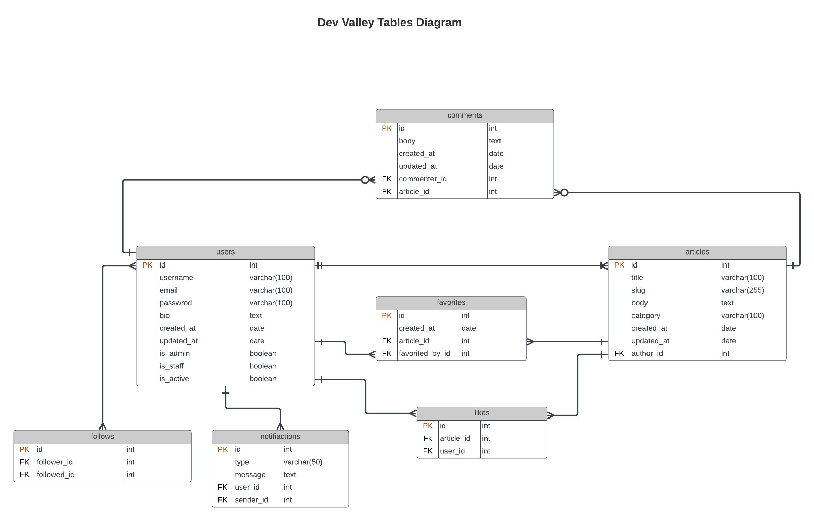

## Dev Valley

### The summary relationships between the classes

- `Users` class has a one-to-many relationship with `Articles` through the articles attribute and with `Comments` through the comments attribute.
- It also has a many-to-many relationship with itself through the followers and following attributes in the Follow class.

- `Articles` class has a many-to-one relationship with `Users` through the author_id attribute.
- It also has a one-to-many relationship with `Comments` through the comments attribute and a one-to-many relationship with `Favorites` through the favorites attribute.

- `Comments` class has a many-to-one relationship with both `Users` and `Articles` through the commenter_id and article_id attributes, respectively.

- `Favorite` class has a many-to-one relationship with both `Users` and `Articles` through the favorited_by_id and article_id attributes, respectively.

- `Follows` class represents a many-to-many relationship between `Users` and itself through the follower_id and following_id attributes.

- `Notifications` class has a many-to-one relationship with `Users` through the user_id attribute.

- `Likes` class has a many-to-one relationship with both `Users` and `Articles` through the user_id and article_id attributes, respectively.

## Tables Diagram

